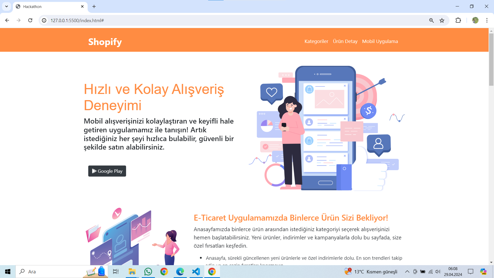
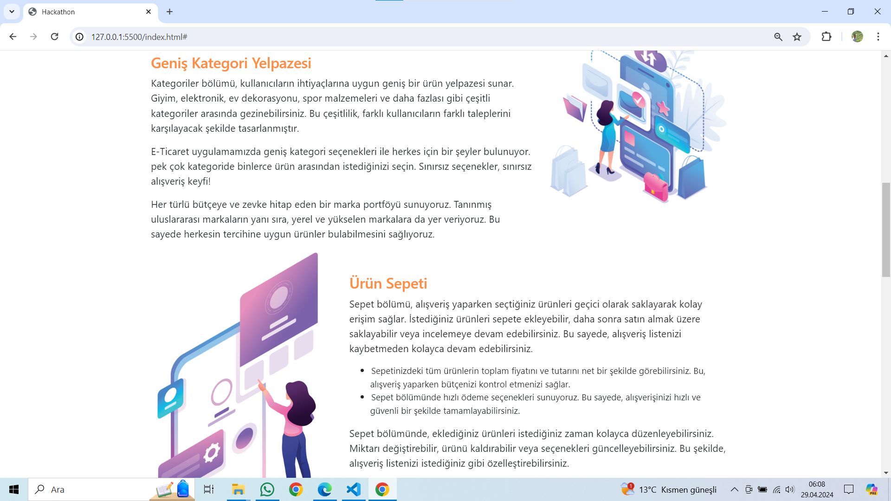
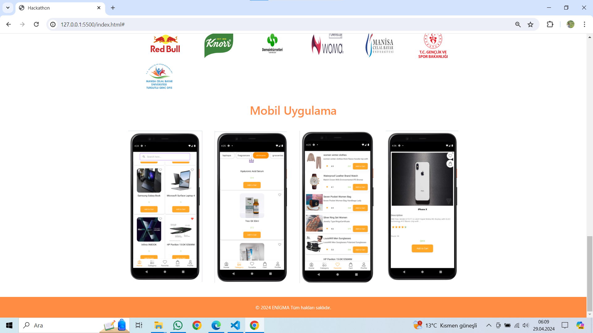

# Mini E-Ticaret Mobil Uygulama Tanıtımı

Bu proje, Talentia Union tarafından düzenlenen 48 saatlik hackathon etkinliği kapsamında
Kotlin programlama dili kullanılarak geliştirilmiş bir mini e-ticaret mobil uygulamasınının tanıtımını içerir. Uygulama, kullanıcıların kolayca ürünleri görüntüleyebileceği, sepete ekleyebileceği ve satın alabileceği temel bir e-ticaret deneyimi sunar.

## Mobil Uygulama Özellikleri

1. Kullanıcıların kategorize edilmiş ürünleri görüntüleyebilmesi ve detaylarına ulaşabilmesi.
2. Kullanıcıların ürünleri sepete ekleyebilmesi ve sepet içeriğini yönetebilmesi.
3. kullanıcıların ürünleri satın alabilmesi

## Web Sitesi Özellikleri

Mobil uygulamanın detaylı tanıtımı ve özelliklerini içerir

## Ekran Görüntüleri

